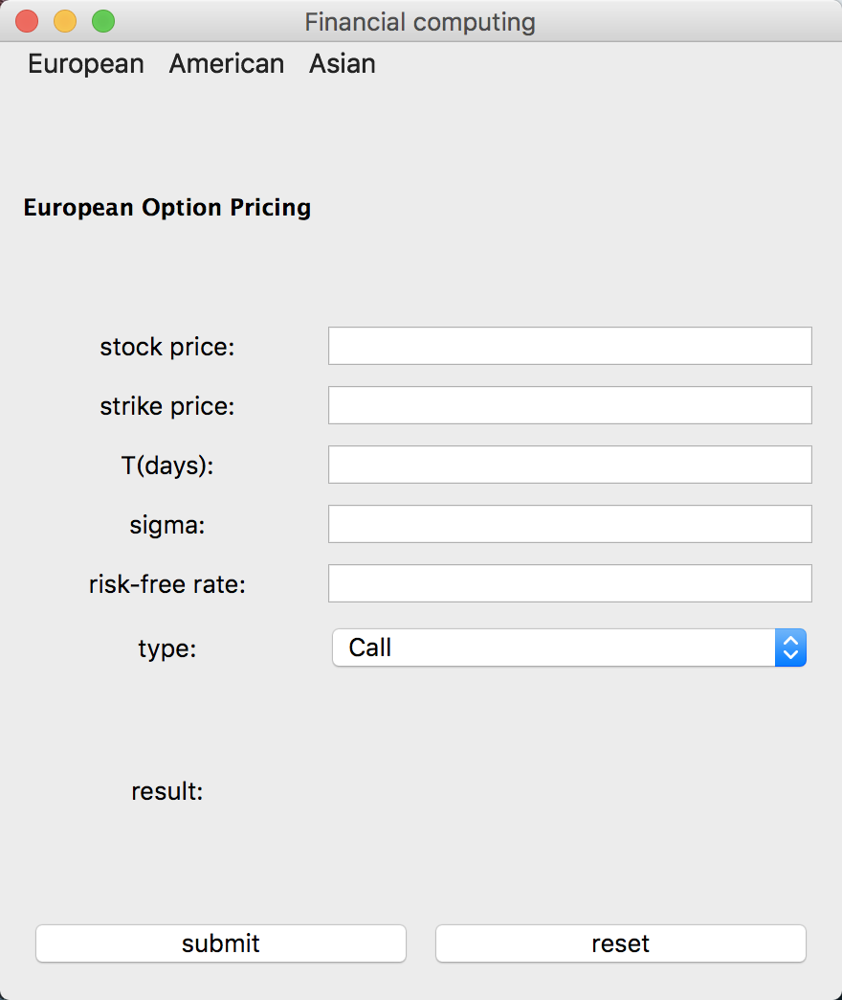
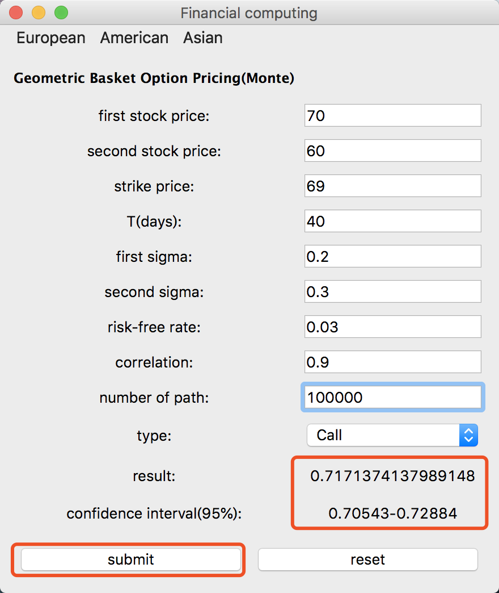

## Contributions

Yuming Chen: European call/put option,Implied volatility,Geometric basket option,Arithmetic basket option

Hongyi Huang:American call/put option, User Interface

Shanyu Xiong:Arithmetic Asian option,Geometric Asian option,User Interface

## User Interface
###Developing Tools
`Python3.7`
`PYQT5`
###UI structure
* Menu
  1. European contains the option price and Volatility
<br><br>
  2. American contains the Option price
<br><br>
  3. Asian contains the Geometric and Arithmetic option pricing
<br><br>
* All Pages
  1. European option pricing
<br><br>
  2. Implied volatility
<br><br>
  3. American option pricing
<br><br>
  4. Geometric option pricing
<br><br>
  5. Geometric option pricing(Monte Carlo)
<br><br>
  6. Geometric basket option pricing
<br><br>
  7. Geometric basket option pricing(Monte Carlo)
<br><br>
  8. Arithmetic option pricing
<br><br>
  9. Arithmetic basket option pricing
<br><br>

###UI interaction
* Submit
When clicking the `submit button`, all the parameter will be collected for calculating the result(and the confidence interval for Monte Carlo).
<br><br>
* Reset
When clicking the `reset`, all the parameter will be set empty and default. 


* Code<br>
`UI.py`

## Functionalities Description

###European\_Option
The function `European_option` is used to calculate the price of **European Option** with closed form solution. This function has following parameters:

* stock is asset price $S(0)$, which represents the price at initial time
* sigma is volatility $\sigma$
* r is risk free interest rate $r$
* T is total time from initial time to the maturity date $T$, the unit is year
* strike is strike price $K$
* type is option type, 'Put' or 'Call'

The **return value** is the **closed form solution** for European solution

```python
def d1(stock,strike,T,sigma,r):
    return (math.log(stock/strike,math.e)+(r+0.5*math.pow(sigma,2))*(T))/(sigma*math.sqrt(T))

def European_option(stock,strike,T,sigma,r,type):
    D1 = d1(stock, strike, T, sigma, r)
    D2 = D1 - sigma * math.sqrt(T)
    price = stock * norm.cdf(D1) - strike * math.exp(-r * (T)) * norm.cdf(D2)
    if type=='Put':
        price = price+strike*math.exp(-r*(T))-stock
    return price
```

###Implied_volatility
The function `Implied_volatility` is used to calculate the **Implied volatility** with closed form solution. This function has following parameters:

* stock is asset price $S(0)$, which represents the price at initial time
* true_price is the true price of the option
* r is risk free interest rate $r$
* T is total time from initial time to the maturity date $T$, the unit is year
* strike is strike price $K$
* type is option type, 'Put' or 'Call'

The **return value** is the **closed form solution** for Implied Volatility

```python
def Implied_volatility(stock,strike,T,r,true_price,type):
    threshold=1e-8
    nmax=5000
    sigma_hat=math.sqrt(2*abs((math.log(stock/strike)+(r)*T)/(T)))
    sigma=sigma_hat
    sigmadiff=1
    n=1
    judge=0
    while sigmadiff > threshold and n<nmax:
        price = European_option(stock,strike,T,sigma,r,type)
        D1=d1(stock,strike,T,sigma,r)
        temp=-(math.log(stock/strike)+(r)*T)/(sigma*sigma*math.sqrt(T))+0.5*math.sqrt(T)
        vega=stock*math.sqrt(T)
        vega=vega*(1/math.sqrt(2*math.pi))*math.exp(-0.5*(D1*D1))*(-D1)*temp
        increment=(price-true_price)/(vega+10.0)
        sigma=sigma-increment
        n=n+1
        sigmadiff=abs(increment)
        if sigmadiff<=threshold:
            judge=1
    if judge==0:
        return "nan"
    return sigma
```
 

###Geometric\_Asian\_Option

The function `Geometric_Asian_Option` is used to calculate the price of **Geometric Asian Option** with closed form solution. This function has following parameters:

* S is asset price $S(0)$, which represents the price at initial time
* sigma is volatility $\sigma$
* r is risk free interest rate $r$
* T is total time from initial time to the maturity date $T$, the unit is year
* K is strike price $K$
* n is number of observation times for geometric average n
* option_type is option type, 'Put' or 'Call'

The **return value** is the **closed form solution** for Asian Geometric solution

```python 
def Geometric_Asian_Option(S, sigma, r, T, K, n, option_type):
    sigma_hat = sigma * math.sqrt((n + 1) * (2 * n + 1)/ (6 * n** 2))
    mu_hat = (r - 0.5 * sigma** 2)*(n + 1)/(2*n) + 0.5 * sigma_hat** 2
    d1_hat = (math.log(S / K) + (mu_hat + 0.5 * sigma_hat** 2) * T)/(sigma_hat * math.sqrt(T))
    d2_hat = d1_hat - sigma_hat * math.sqrt(T)
    if option_type == 'Call':
        return math.exp(-r * T) * (S * math.exp(mu_hat * T) * norm.cdf(d1_hat) - K * norm.cdf(d2_hat))
    elif option_type == 'Put':
        return math.exp(-r * T) * (K * norm.cdf(-d2_hat) - S * math.exp(mu_hat * T) * norm.cdf(-d1_hat))
```

### Arithmetic\_Asian\_Option
The function `Arithmetic_Asian_Option` is used to calculate the price of **Arithmetic Asian Option** with closed form solution. This function has following parameters:

* S is asset price $S(0)$, which represents the price at initial time
* sigma is volatility $\sigma$
* r is risk free interest rate $r$
* T is total time from initial time to the maturity date $T$, the unit is year
* K is strike price $K$
* n is number of observation times for geometric average n
* option_type is option type, 'Put' or 'Call'
* path is the number of paths in Monte Carlo Simulation
* ctr_method is to specify the control variate method, the default value is **None**. The user need to input 'control variate' to use this method.

The **return values** of this function are

 1. **Value of Arithmetic Asian Option**
 2. **The confidence interval for value of Arithmetic Asian Option**
 3. **Value of Geometric Asian Option based on Monte Carlo Method**
 4. **The confidence interval for alue of Geometric Asian Option based on Monte Carlo Method**

```python
def Arithmetic_Asian_Option(S, sigma, r, T, K, n, option_type, path, ctr_method = None):
    geo = Geometric_Asian_Option(S, sigma, r, T, K, n, option_type)
    Dt = T / n
    drift = math.exp((r - 0.5 * sigma** 2) * Dt)
    random.seed(1)
    spath = []
    for i in range(path):
        sample = []
        growthFactor = drift * math.exp(sigma * math.sqrt(Dt) * random.gauss(0,1))
        sample.append(S * growthFactor)
        for j in range(1, n):
            growthFactor = drift * math.exp(sigma * math.sqrt(Dt) * random.gauss(0,1))
            sample.append(sample[j-1] * growthFactor)
        spath.append(sample)
    
    Spath = np.array(spath)
    
    #Arithmetic Mean
    arithMean = np.mean(Spath, axis = 1)
    if(option_type == 'Call'):
        arithPayOff = math.exp(-r * T) * np.maximum(arithMean - K , 0)
    elif(option_type == 'Put'):
        arithPayOff = math.exp(-r * T) * np.maximum(K - arithMean , 0)
    #Geomrteic Mean
    geoMean = np.exp((1/n) * np.sum(np.log(Spath), axis = 1))
    if(option_type == 'Call'):
        geoPayOff = math.exp(-r * T) * np.maximum(geoMean - K , 0)
    elif(option_type == 'Put'):
        geoPayOff = math.exp(-r * T) * np.maximum(K - geoMean , 0)
        
    #Standard Monte Carlo for Asian Geometric
    Geo_mean = np.mean(geoPayOff)
    Geo_std = np.std(geoPayOff)
    confmc_geo = [Geo_mean - 1.96 * Geo_std/math.sqrt(path), Geo_mean + 1.96 * Geo_std/math.sqrt(path)]
    
    #Standard Monte Carlo
    Pmean = np.mean(arithPayOff)
    Pstd = np.std(arithPayOff)
    confmc = [Pmean - 1.96 * Pstd/math.sqrt(path), Pmean + 1.96 * Pstd/math.sqrt(path)]
    
    # control variate
    covXY = np.mean(arithPayOff * geoPayOff) - np.mean(arithPayOff) * np.mean(geoPayOff)
    theta = covXY / (np.var(geoPayOff))
    
    #control varite version
    Z = arithPayOff + theta * (geo - geoPayOff)
    Zmean = np.mean(Z)
    Zstd = np.std(Z)
    confcv = [Zmean - 1.96 * Zstd/math.sqrt(path), Zmean + 1.96 * Zstd/math.sqrt(path)]
    
    if(ctr_method == None):
        return Pmean, confmc, Geo_mean, confmc_geo
    return Zmean, confcv, Geo_mean, confmc_geo
```

###Geo\_Basket\_option

The function `Geo_Basket_option` is used to calculate the price of **Geometric Basket Option** with closed form solution. This function has following parameters:

* S1, S2 are asset prices $S_{1}(0)$ and $S_{2}(0)$,  which represent the prices at initial time
* sigma1 and sigma2 are volatilities $\sigma_1$ and $\sigma_2$
* r is risk free interest rate $r$
* T is total time from initial time to the maturity date $T$, the unit is year
* K is strike price $K$
* rho is correlation $\rho$
* option_type is option type, 'Put' or 'Call'

The **return value** is the **closed form solution** for Geometric Basket Option

```python 
def Geo_Basket_option(S1, S2, sigma1, sigma2, r, T, K, rho, option_type):
    sigma_B_g = math.sqrt(sigma1** 2 + 2 * sigma1 * sigma2 * rho + sigma2** 2) / 2
    mu_B_g = r - 0.5 * (sigma1** 2 + sigma2** 2) / 2 + 0.5 * sigma_B_g** 2
    B_g_0 = (S1 * S2)** (1/2)
    d1_hat = (math.log(B_g_0 / K) + (mu_B_g + 0.5 * sigma_B_g** 2)* T) / (sigma_B_g * math.sqrt(T))
    d2_hat = d1_hat - sigma_B_g * math.sqrt(T)
    if(option_type == 'Call'):
        return math.exp(-r * T) * (B_g_0 * math.exp(mu_B_g * T) * norm.cdf(d1_hat) - K * norm.cdf(d2_hat))
    elif(option_type == 'Put'):
        return math.exp(-r * T) * (K * norm.cdf(-d2_hat) - B_g_0 * math.exp(mu_B_g * T) * norm.cdf(-d1_hat))
```

### Ari\_Basket\_option

The function `Ari_Basket_option` is used to calculate the price of **Geometric Basket Option** with closed form solution. This function has following parameters:

* S1, S2 are asset prices $S_{1}(0)$ and $S_{2}(0)$,  which represent the prices at initial time
* sigma1 and sigma2 are volatilities $\sigma_1$ and $\sigma_2$
* r is risk free interest rate $r$
* T is total time from initial time to the maturity date $T$, the unit is year
* K is strike price $K$
* rho is correlation $\rho$ between option1 and option2
* option_type is option type, 'Put' or 'Call'
* path is the number of paths in Monte Carlo Simulation
* ctr_method is to specify the control variate method, the default value is **None**. The user need to input 'control variate' to use this method.

The **return values** of this function are

 1. **Value of Arithmetic Basket Option**
 2. **The confidence interval for value of Arithmetic Basket Option**
 3. **Value of Geometric Basket Option based on Monte Carlo Method**
 4. **The confidence interval for alue of Geometric Basket Option based on Monte Carlo Method**
 
 ```python
 def Ari_Basket_option(S1, S2, sigma1, sigma2, r, T, K, rho, option_type, path, ctr_method = None):
    geo_basket = Geo_Basket_option(S1, S2, sigma1, sigma2, r, T, K, rho, option_type)
    drift1 = math.exp((r - 0.5 * sigma1** 2) * T)
    drift2 = math.exp((r - 0.5 * sigma2** 2) * T)
    bucket = []
    random.seed(1)
    for i in range(path):
        sample = []
        Z1 = random.gauss(0,1)
        Y = random.gauss(0,1)
        Z2 = rho * Z1 + math.sqrt(1 - rho** 2) * Y
        growthFactor1 = drift1 * math.exp(sigma1 * math.sqrt(T) * Z1)
        growthFactor2 = drift2 * math.exp(sigma2 * math.sqrt(T) * Z2)
        sample.append(S1 * growthFactor1)
        sample.append(S2 * growthFactor2)
        bucket.append(sample)
    
    Bucket = np.array(bucket)
    
    #Arithmetic Mean
    arithMean = np.mean(Bucket, axis = 1)
    if(option_type == 'Call'):
        arithPayOff = math.exp(-r * T) * np.maximum(arithMean - K , 0)
    elif(option_type == 'Put'):
        arithPayOff = math.exp(-r * T) * np.maximum(K - arithMean , 0)
    
    #Geomrteic Mean
    geoMean = np.exp(0.5 * np.sum(np.log(Bucket), axis = 1))
    if(option_type == 'Call'):
        geoPayOff = math.exp(-r * T) * np.maximum(geoMean - K , 0)
    elif(option_type == 'Put'):
        geoPayOff = math.exp(-r * T) * np.maximum(K - geoMean , 0)
        
    #Standard Monte Carlo for Asian Geometric
    Geo_mean = np.mean(geoPayOff)
    Geo_std = np.std(geoPayOff)
    confmc_geo = [Geo_mean - 1.96 * Geo_std/math.sqrt(path), Geo_mean + 1.96 * Geo_std/math.sqrt(path)]
        
    #Standard Monte Carlo
    Pmean = np.mean(arithPayOff)
    Pstd = np.std(arithPayOff)
    confmc = [Pmean - 1.96 * Pstd/math.sqrt(path), Pmean + 1.96 * Pstd/math.sqrt(path)]
    
    # control variate
    covXY = np.mean(arithPayOff * geoPayOff) - np.mean(arithPayOff) * np.mean(geoPayOff)
    theta = covXY / (np.var(geoPayOff))
    
    #control varite version
    Z = arithPayOff + theta * (geo_basket - geoPayOff)
    Zmean = np.mean(Z)
    Zstd = np.std(Z)
    confcv = [Zmean - 1.96 * Zstd/math.sqrt(path), Zmean + 1.96 * Zstd/math.sqrt(path)]
    
    if(ctr_method == None):
        return Pmean, confmc, Geo_mean, confmc_geo
    return Zmean, confcv, Geo_mean, confmc_geo
 ```
### American\_option
The function `American_option` is used to calculate the price of **American Call/Put Option** with Biminial Tree method. This function has following parameters:

* S is the spot price of asset $S(0)$ 
* K is strike price $K$
* sigma is volatility $\sigma$ 
* r is risk free interest rate $r$
* T is total time from initial time to the maturity date $T$, the unit is year
* step is the number of step $N$ 
* Type is option type, 'Put' or 'Call'

The **return values** of this function is the option price at $T(0)$

```python
  def American_option( K , S , T , r , sigma, step, Type ):
    K = float(K)
    S = float(S)
    T = float(T)
    r = float(r)
    sigma = float(sigma)
    step = int(step)
    dt = T/step     #delta_t
    DF = np.e**(-r *dt)    # discount factor
    up = np.e**(sigma*np.sqrt(dt))    # u
    down = 1/up      #d
    p = (np.e**(r*dt)-down)/(up-down)   # probability
    stock=np.zeros((step+1,step+1))     # record asset price 
    option = np.zeros((step+1,step+1))  # record option price 
    stock[0][0] = S                     #initialize asset price 
    
    # according to related position, calculate stock price
    for i in range(1,step+1):
        for j in range(i):
            stock[j][i] = stock[j][i-1] * up      
            stock[j+1][i] = stock[j][i-1] * down
# Put            
    if Type == 'Put':
        for i in range(step+1):        # calculate option price at maturity
            option[i][step] =max(K-stock[i][step],0) 
        inverse = step   
    
    # backforward calculate option price at each step
        while ( inverse > 0 ):
            for i in range(inverse):
                price = DF * (p * option[i][inverse] + (1-p) * option[i+1][inverse])
                option[i][inverse-1] = max((K - stock[i][inverse-1]), price)
            inverse-=1
# American Call is the same as European            
    else:
        for i in range(step+1):        # calculate option price at maturity
            option[i][step] =max(stock[i][step]-K,0) 
        inverse = step   
    
    # backforward calculate option price at each step
        while ( inverse > 0 ):
            for i in range(inverse):
                price = DF * (p * option[i][inverse] + (1-p) * option[i+1][inverse])
                option[i][inverse-1] = price
            inverse-=1
    return option[0][0] 
```
## Test Cases and Analysis 

### Asian Option

The following are the test cases for Asian Options

```python
c1 = {'sigma' : 0.3, 'K' : 100, 'n' : 50, 'Type' : 'Put', 'ctr_method': 'control variate'}
c2 = {'sigma' : 0.3, 'K' : 100, 'n' : 100, 'Type' : 'Put', 'ctr_method': 'control variate'}
c3 = {'sigma' : 0.4, 'K' : 100, 'n' : 50, 'Type' : 'Put', 'ctr_method': 'control variate'}
c4 = {'sigma' : 0.3, 'K' : 100, 'n' : 50, 'Type' : 'Call', 'ctr_method': 'control variate'}
c5 = {'sigma' : 0.3, 'K' : 100, 'n' : 100, 'Type' : 'Call', 'ctr_method': 'control variate'}
c6 = {'sigma' : 0.4, 'K' : 100, 'n' : 50, 'Type' : 'Call', 'ctr_method': 'control variate'}
```
The results show that

* With other parameters fixed, as number of obeservations for geometric/arithmetic average $n \nearrow$ (rises), the price of geometric/arimetic option will $\searrow$ (go down).
* With other parameters fixed, as volatility $\sigma \nearrow$ (rises), the price of geometric\arithmetic option will $\nearrow$ (go up).


### Basket Option

The following are the test cases for Basket options

```python
c1 = {'S1' : 100, 'S2' : 100, 'K' : 100, 'sigma1' : 0.3, 'sigma2' : 0.3, 'rho': 0.5, 'option' : 'Put'}
c2 = {'S1' : 100, 'S2' : 100, 'K' : 100, 'sigma1' : 0.3, 'sigma2' : 0.3, 'rho': 0.9, 'option' : 'Put'}
c3 = {'S1' : 100, 'S2' : 100, 'K' : 100, 'sigma1' : 0.1, 'sigma2' : 0.3, 'rho': 0.5, 'option' : 'Put'}
c4 = {'S1' : 100, 'S2' : 100, 'K' : 80, 'sigma1' : 0.3, 'sigma2' : 0.3, 'rho': 0.5, 'option' : 'Put'}
c5 = {'S1' : 100, 'S2' : 100, 'K' : 120, 'sigma1' : 0.3, 'sigma2' : 0.3, 'rho': 0.5, 'option' : 'Put'}
c6 = {'S1' : 100, 'S2' : 100, 'K' : 100, 'sigma1' : 0.5, 'sigma2' : 0.5, 'rho': 0.5, 'option' : 'Put'}
c7 = {'S1' : 100, 'S2' : 100, 'K' : 100, 'sigma1' : 0.3, 'sigma2' : 0.3, 'rho': 0.5, 'option' : 'Call'}
c8 = {'S1' : 100, 'S2' : 100, 'K' : 100, 'sigma1' : 0.3, 'sigma2' : 0.3, 'rho': 0.9, 'option' : 'Call'}
c9 = {'S1' : 100, 'S2' : 100, 'K' : 100, 'sigma1' : 0.1, 'sigma2' : 0.3, 'rho': 0.5, 'option' : 'Call'}
c10 = {'S1' : 100, 'S2' : 100, 'K' : 80, 'sigma1' : 0.3, 'sigma2' : 0.3, 'rho': 0.5, 'option' : 'Call'}
c11 = {'S1' : 100, 'S2' : 100, 'K' : 120, 'sigma1' : 0.3, 'sigma2' : 0.3, 'rho': 0.5, 'option' : 'Call'}
c12 = {'S1' : 100, 'S2' : 100, 'K' : 100, 'sigma1' : 0.5, 'sigma2' : 0.5, 'rho': 0.5, 'option' : 'Call'}
```
The results show that

* With other parameters fixed, as correlation coefficient $\rho \nearrow$ (rises), the price of basket option will $\nearrow$ (go up).
* With other parameters fixed, as one of the volatility $\sigma \searrow$ (decreases) (or $\nearrow$ increases), the price of geometric\arithmetic basket option will $\searrow$ (go down) (or $\nearrow$ (go up)).
* With other parameters fixed, as the strike price rises$\nearrow$ (or decreases$\searrow$), the price of geometric\arithmetic basket with **call** options will $\searrow$ (go down) (or $\nearrow$ (go up)); the price of geometric\arithmetic basket with **put** options will $\nearrow$ (go up) (or $\searrow$ (go down))
